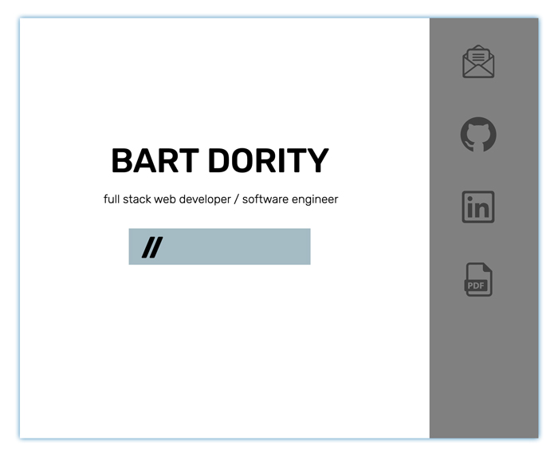

# Portfolio #3
A portfolio that uses node.js, express, handlebars and ejs and is deployed on heroku

# Table of contents

1. [Live Demo](#Live_Demo)
2. [License](#License)
3. [Features](#Features)
4. [Technology](#Technology)
5. [Badges](#Badges)

## Live Demo
<a href='https://stark-sea-41121.herokuapp.com/'>Live Demo Deployed on Heroku</a>

## License

## Features
1. Full Stack Application
2. Includes PDF Resume
3. Mobile-first design, and adaptive layout

## Technology
1. Node.js
2.  Express
3.  EJS
4.  Custom CSS, with media queries
5.  HTML 5

## Badges
 
  

**on github:** <a href='github.com/b0rgBart3'>b0rgBart3</a>

Email: borgBart3@gmail.com
